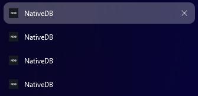
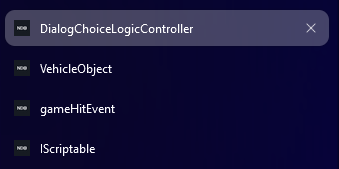

# Title Updater for NativeDB

A userscript that dynamically updates the browser tab title to match the content of the current page on https://nativedb.red4ext.com.

## Features

- Automatically updates browser tab title to match page content
- Efficient mutation observation to minimize performance impact
- Zero dependencies

**Before**



**After**




## Installation

1. **Install a Userscript Manager**
   - For Chrome: [Tampermonkey](https://chrome.google.com/webstore/detail/tampermonkey/dhdgffkkebhmkfjojejmpbldmpobfkfo)
   - For Firefox: [Greasemonkey](https://addons.mozilla.org/en-US/firefox/addon/greasemonkey/)
   - For Safari: [Userscripts](https://apps.apple.com/us/app/userscripts/id1463298887)

2. **Install the Script**
   - Click on the userscript manager icon in your browser
   - Select "Create new script"
   - Copy and paste the entire script from `title-updater.user.js`
   - Save the script (usually Ctrl+S or ⌘+S)

## How It Works

The script uses a MutationObserver to monitor changes to the DOM on NativeDB pages. When it detects changes that affect the `.title>h1` element, it updates the browser tab title to match the content of this element.

```javascript
// Example of the core functionality
function updateTitle() {
    const titleElement = document.querySelector('.title>h1');
    if (titleElement) {
        document.title = titleElement.textContent.trim();
    }
}
```


## Browser Compatibility

- Chrome 49+
- Firefox 52+
- Safari 10+
- Edge 79+

## Development

To set up the development environment:

1. Clone the repository
   ```bash
   git clone https://github.com/yourusername/nativedb-title-updater.git
   ```
2. Make your changes in `title-updater.user.js`
3. Test the script on https://nativedb.red4ext.com

## License

This project is licensed under the MIT License - see below for details:

```
MIT License

Copyright (c) 2024 Your Name

Permission is hereby granted, free of charge, to any person obtaining a copy
of this software and associated documentation files (the "Software"), to deal
in the Software without restriction, including without limitation the rights
to use, copy, modify, merge, publish, distribute, sublicense, and/or sell
copies of the Software, and to permit persons to whom the Software is
furnished to do so, subject to the following conditions:

The above copyright notice and this permission notice shall be included in all
copies or substantial portions of the Software.

THE SOFTWARE IS PROVIDED "AS IS", WITHOUT WARRANTY OF ANY KIND, EXPRESS OR
IMPLIED, INCLUDING BUT NOT LIMITED TO THE WARRANTIES OF MERCHANTABILITY,
FITNESS FOR A PARTICULAR PURPOSE AND NONINFRINGEMENT. IN NO EVENT SHALL THE
AUTHORS OR COPYRIGHT HOLDERS BE LIABLE FOR ANY CLAIM, DAMAGES OR OTHER
LIABILITY, WHETHER IN AN ACTION OF CONTRACT, TORT OR OTHERWISE, ARISING FROM,
OUT OF OR IN CONNECTION WITH THE SOFTWARE OR THE USE OR OTHER DEALINGS IN THE
SOFTWARE.
```

## Support

If you encounter any issues or have questions, please:

1. Check the [Issues](https://github.com/yourusername/nativedb-title-updater/issues) page to see if your problem has already been reported
2. Create a new issue if necessary, including as much relevant information as possible

## Acknowledgments

- Thanks to the NativeDB team for their excellent documentation platform
